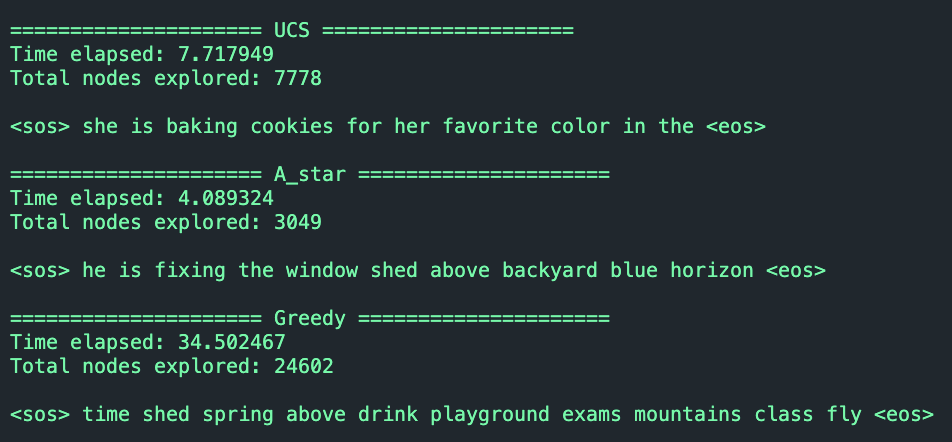
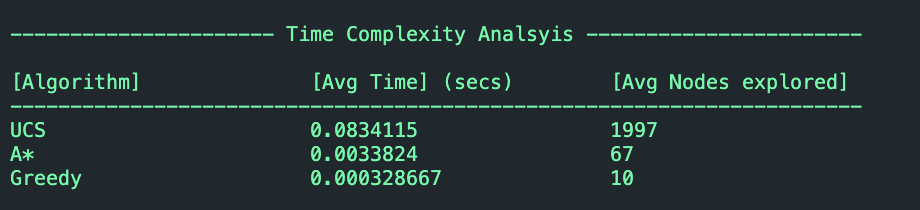

# AI Search based text generator

NLP text generator using search strategies like A*, UCS & Greedy  using bigram conditional probabilities

<p align="center">
    
    
</p>


### Features
- Parsing text corpus to generate bigram conditional probabilites
- Generates vocabulary
- N-word sequence generator using AI search algorithms 
    - A* Search
    - Greedy Search
    - UCS
- Time complexity Analysis


### Setup Instructions
Run the following in terminal
```bash
git clone https://github.com/vansh2308/ai-search-based-text-generator.git
cd ./ai-search-based-text-generator
```

__For using a custom corpus text data__
Requirements - numpy 
Copy Paste your data in corpus.txt with each line having starting & ending tokens.

Run the following in terminal
```bash
python3 bigram-model.py 
```

This will generate 2 files trans2.txt & vocab2.txt in your working directory.

__Text generration__
Tweak the value of n in main.cpp (no of words in seq)

Run the following in terminal
```bash
g++ ./main.cpp -o main.exe && ./main.exe
```


### Author
- Github - [vansh2308](https://github.com/vansh2308)
- Website - [Vansh Agarwal](https://portfolio-website-self-xi.vercel.app/)
